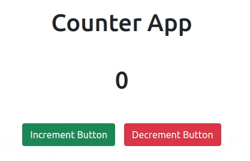
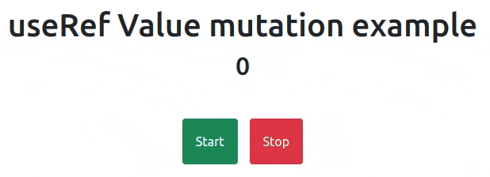
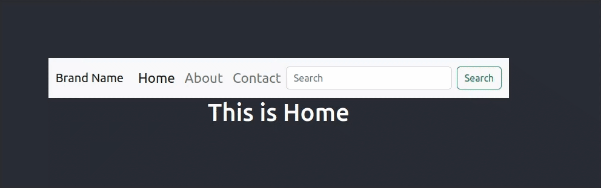
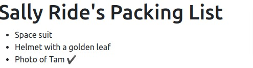
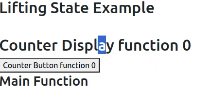
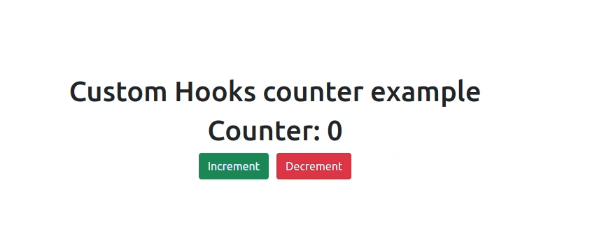
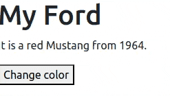
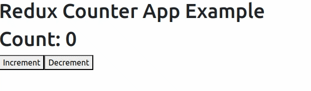
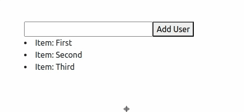
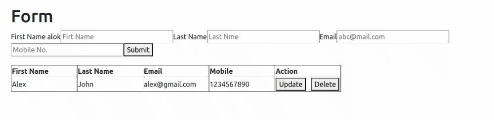

# Coding Practice Screenshots 👩‍💻

### Table of Contents

| Number | Topic                                                   |
| ------ | ------------------------------------------------------- |
| 1      | [Functional Component](#Functional-Component-example)   |
| 2      | [Counter App](#counter-app-state-hook-example)          |
| 3      | [useRef Value Mutation](#useref-value-mutation-example) |
| 4      | [Routing](#routing-example)                             |
| 5      | [Conditional Rendering](#conditional-rendering-example) |
| 6      | [Context API](#context-api-example)                     |
| 7      | [Lifting State Up](#lifting-state-up-example)           |
| 8      | [Custom Hooks](#custom-hooks)                           |
| 9      | [Props in React.js](#props-example)                     |
| 10     | [Class Component](#Class-component)                     |
| 11     | [Redux Example](#Redux-Example)                         |
| 12     | [Todo Example](#Todo-Example)                           |
| 13     | [Curd Example](#Curd-Example)                           |

### [Functional Component Example](https://github.com/alokt1994/react-example/blob/main/Create-functional-component/src/Profiler.js)

  
Functional Component

  
  
  
  **Description**: An example showcasing the use of functional component.
  

### [Counter App State Hook Example](https://github.com/alokt1994/react-example/blob/main/counter-app/src/Counter/Counter.js)

  
Counter App Screenhshot

  
  
  
  **Description**: A simple counter application that demonstrates basic state management and user interaction in React.
  

### [useRef value mutation Example](https://github.com/alokt1994/react-example/blob/main/react-useref/src/Counter/Useref_use_case_1.js)

  
useRef Screenshot

**Description**: An example showcasing the use of useRef for value mutation without re-rendering components in React.

### [Routing Example](https://github.com/alokt1994/react-example/blob/main/react-routing/src/App.js)

  
Routing

**Description**: An example showcasing the use of routing.

### [Conditional Rendering Example](https://github.com/alokt1994/react-example/tree/main/conditional-rendering/src)

  
Conditional Rendering

**Description**: An example showcasing the use of conditional rendering when condition is true then add right sign in front of item.

### [Context API Example](https://github.com/alokt1994/react-example/tree/main/react-context/src)

  
Context API

**Description**: An example showcasing the use of context-api.

### [Lifting State Up Example](https://github.com/alokt1994/react-example/blob/main/react-lifting/src/lifting-state/ParentComponent.js)

  
Lifting State Up

**Description**: An example showcasing the use of Lifting State Up.

### [Custom Hooks Example](https://github.com/alokt1994/react-example/tree/main/custom-hooks/src/Counter)

  
Custom Hooks

**Description**: An example showcasing the use of Custom Hooks.

### [Props Example](https://github.com/alokt1994/react-example/blob/main/propsExample/src/Profiler.js)

  
Props Example

**Description**: An example showcasing the use of Props in react.js.

### [Class Component Example](https://github.com/alokt1994/react-example/blob/main/react-classcomponent/src/Welcome/Car.js)

  
Class Component

**Description**: An example showcasing the use of class component.

### [Redux Example](https://github.com/alokt1994/react-example/tree/main/redux-counterapp/src)

  
Redux Example

**Description**: An example showcasing the use of Redux counterapp.

### [Todo Example](https://github.com/alokt1994/react-example/blob/main/react-todo/src/Todo/Todo.js)

  
Todo Example

**Description**: An example showcasing the use of Todo Example.

### [Curd Example](https://github.com/alokt1994/react-example/tree/main/react-formik/src/UserCrud)

  
Curd Example

**Description**: An example showcasing the use of Curd Example.

